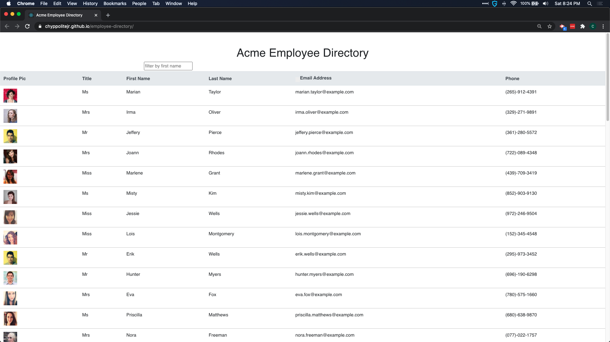

  # React Employee Directory 

  # Table of Contents 

  [Description](#description) 

  [Technologies Used](#technologies-used) 

  [Screenshots](#application-screenshots) 

  [Installation](#installation) 

  [Application Usage](#usage) 

  [Credits](#credits) 

  [Deployed Application](#deployed-application) 

  [License](#license) 

  ## Description 

  Bootcamp homework assignment to display a react table with sort and filter functionality 

  ## Technologies Used 

  ReacJS, NodeJS,NPM,react-bootstap, javascript 

  ## Application Screenshots
   Uncomment this line to add application image 

  ## Installation 

  Fork Repo. Clone to local machine. navigate to local repo in terminal. run npm i to install dependencies. run npm start to launch app
  ## Usage 

  app will launch in a new browser window once started. The email address can be sorted. type any letters in search field and employee list will be filtered by first name 

  ## Credits 

   

  ## Deployed Application 

  https://chyppolitejr.github.io/employee-directory 

  ## License 

  Licensed under the [MIT](LICENSE) license.
  